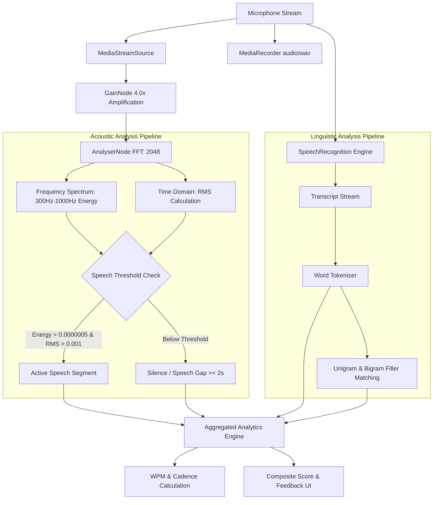

# 🎙️ Voice & Speech Audio Analyzer

[](https://developer.mozilla.org/en-US/docs/Web/JavaScript)
[](https://developer.mozilla.org/en-US/docs/Web/API/Web_Audio_API)
[](https://developer.mozilla.org/en-US/docs/Web/API/Web_Speech_API)
[](https://developer.mozilla.org/en-US/docs/Web/CSS)
[](LICENSE)

> A client-side speech performance and communication analytics engine built with vanilla JavaScript, the **Web Audio API**, and the **Web Speech Recognition API**. Analyzes speaking pace, speech breaks, vocal cadence, and filler words to deliver real-time feedback and an objective **Communication Skill Score**.

---

## 📋 Table of Contents

- [Overview](#-overview)
- [Key Features](#-key-features)
- [System Architecture & Signal Processing](#-system-architecture--signal-processing)
- [Communication Scoring System](#-communication-scoring-system)
- [File Structure](#-file-structure)
- [Getting Started](#-getting-started)
- [Browser Compatibility](#-browser-compatibility)
- [Codebase Reference](#-codebase-reference)
- [Roadmap & Enhancements](#-roadmap--enhancements)
- [License](#-license)

---

## 🌟 Overview

Effective oral communication requires balanced pacing, deliberate pausing, and minimal filler words. **Audio Analyzer** is a privacy-first, in-browser tool that records your speech, transcribes audio in real time, processes voice acoustics, and evaluates delivery metrics across multi-take sessions.

All digital signal processing (DSP) and natural language analysis execute locally in the browser—no third-party servers, backend APIs, or audio uploads required.

---

## ✨ Key Features

- **⚡ Real-Time Digital Signal Processing (DSP)**:
  - Continuously samples frequency and time-domain audio data using browser `AudioContext` and `AnalyserNode`.
  - Filters human vocal energy bands (300 Hz – 1000 Hz) and computes RMS (Root Mean Square) energy to distinguish deliberate speech from background silence.
- **🗣️ Integrated Speech-to-Text & Filler Detection**:
  - Live continuous speech recognition via the Web Speech API (`SpeechRecognition`).
  - Automatic dictionary matching for single fillers (`um`, `uh`, `like`, `hmm`, `ahh`, `er`, `erm`, `so`, `well`, `actually`, `basically`) and multi-word phrases (`you know`, `i mean`).
  - Real-time visual badge highlighting of filler words in the transcript feed.
- **⏱️ Speech Rate (WPM) Measurement**:
  - Calculates Words Per Minute (WPM) mapped exclusively against **active speaking duration** (excluding pauses) for true articulation speed.
  - Automatically categorizes pace into *Slow*, *Average*, *Fast*, or *Very Fast*.
- **⏸️ Speech Gap & Pause Cadence Analysis**:
  - Identifies natural pauses vs. awkward hesitations (breaks $\ge 2.0\text{ s}$).
  - Computes gap frequency (pauses per minute) and average break length.
- **📊 100-Point Composite Communication Score**:
  - Aggregates pacing, filler frequency, and pause rhythm into an overall skill percentage.
  - Visual circular gradient progress dial accompanied by qualitative tiers (*Excellent*, *Good*, *Fair*, *Poor*) and actionable feedback.
- **🎛️ Multi-Stream Session History**:
  - Records multiple audio takes within a single session.
  - Generates HTML5 audio players for instant playback and stream-by-stream inspection.

---

## 🔬 System Architecture & Signal Processing

The application combines acoustic signal processing with natural language tokenization:



### Acoustic Voice Activity Detection (VAD)

1. **Vocal Band Frequency Energy**:
   $$\text{Bin Width} = \frac{\text{Sample Rate}}{\text{FFT Size (2048)}}$$
   Extracts frequency bins corresponding to $300\text{ Hz} - 1000\text{ Hz}$ to measure fundamental vocal formants while filtering out high-frequency hiss and low-frequency rumble.
2. **RMS Amplitude**:
   $$\text{RMS} = \sqrt{\frac{1}{N}\sum_{i=0}^{N-1} x[i]^2}$$
3. **Thresholding**: Speech is flagged when both frequency energy exceeds `0.0000005` and RMS exceeds `0.001`. A gap is logged when silence persists for 2,000 ms or longer.

---

## 📈 Communication Scoring System

The composite score evaluates three pillars of speech performance (Total: **100 points**):

### 1. Speech Pace (Max 25 Points)

| Pace (WPM) | Classification | Score Points | Feedback Guidance |
| :--- | :--- | :---: | :--- |
| **120 – 160** | **Optimal** | **25 pts** | Well-balanced pace, clear articulation. |
| **100 – 119** | Average (Low) | **20 pts** | Moderate pace; can slightly increase tempo. |
| **161 – 180** | Fast | **20 pts** | Quick speech; ensure consonant clarity. |
| **< 100** | Slow | **15 pts** | Slower than conversational benchmark. |
| **> 180** | Very Fast | **15 pts** | Risk of listener fatigue; recommend slowing down. |

### 2. Filler Word Control (Max 30 Points)

| Filler Count | Score Points | Rating |
| :--- | :---: | :--- |
| **0** | **30 pts** | Exceptional discipline and clarity |
| **1 – 4** | **25 pts** | Minimal filler usage; good control |
| **5 – 9** | **20 pts** | Moderate filler presence; room for improvement |
| **10+** | **10 pts** | High filler concentration; distracting to listener |

### 3. Speech Gaps & Rhythm (Max 20 Points)

| Gap Frequency | Avg Gap Duration | Score Points | Cadence Evaluation |
| :---: | :---: | :---: | :--- |
| **2 – 5 / min** | **$\le$ 5.0 s** | **20 pts** | Ideal pause structure; allows audience processing |
| **5 – 7 / min** | **$\le$ 7.0 s** | **15 pts** | Slightly elevated break frequency |
| **Other / Gaps Present** | Any | **10 pts** | Irregular pause distribution |

### Overall Rating Tiers

- 🟢 **75 – 100%**: **Excellent** — Outstanding communication flow.
- 🔵 **58 – 74%**: **Good** — Solid foundation with minor refinements needed.
- 🟡 **40 – 57%**: **Fair** — Inconsistent pacing or noticeable filler dependency.
- 🔴 **< 40%**: **Poor** — Significant hesitations and speech clarity issues.

---

## 📁 File Structure

```text
Audio/
├── index.html         # Main user interface layout and metric containers
├── styles.css         # Clean, responsive CSS styling with score dial animations
├── script.js          # Live recording controller, Web Audio/Speech integration & DOM updater
└── audioAnalysis.js   # Standalone AudioAnalyzer class for offline batch processing
```

### Components Summary

- **`index.html`**: Accessible semantic HTML structure containing control buttons, metric cards, status banner, dynamic score dial, and stream history container.
- **`styles.css`**: Mobile-responsive layout styled with CSS Grid and Flexbox, featuring CSS custom property dynamic conic-gradients (`--score-percent`) for the circular score gauge.
- **`script.js`**: Real-time recording orchestrator. Manages `MediaRecorder`, `AudioContext`, live audio buffer frames, and Web Speech API event listeners.
- **`audioAnalysis.js`**: Reusable standalone analyzer module (`AudioAnalyzer`) that accepts raw audio blobs and transcripts to perform programmatic batch analysis without UI dependencies.

---

## 🚀 Getting Started

### Prerequisites

- A modern web browser supporting **Web Speech Recognition** and **Web Audio API** (Google Chrome or Microsoft Edge recommended).
- An active microphone input.

> **Note on Permissions**: Modern browsers require either `http://localhost`, `http://127.0.0.1`, or an `https://` secure context to access microphone hardware and the Web Speech API.

### Running Locally

Clone the repository and launch any local HTTP server:

```bash
# Clone the repository
git clone https://github.com/AhryRaj/Audio.git

# Navigate into the project folder
cd Audio
```

#### Option A: Using Python (Built-in)
```bash
# Python 3.x
python3 -m http.server 8000
```
Open [http://localhost:8000](http://localhost:8000) in Google Chrome or Microsoft Edge.

#### Option B: Using Node.js `npx serve`
```bash
npx serve .
```

#### Option C: VS Code Live Server
Right-click `index.html` in VS Code and select **"Open with Live Server"**.

---

## 🌐 Browser Compatibility

| Feature | Chrome | Edge | Safari | Firefox |
| :--- | :---: | :---: | :---: | :---: |
| **Web Audio API** | ✅ Full | ✅ Full | ✅ Full | ✅ Full |
| **MediaRecorder (Audio)** | ✅ Full | ✅ Full | ✅ Full | ✅ Full |
| **Web Speech API (`webkitSpeechRecognition`)** | ✅ Full | ✅ Full | ⚠️ Limited / Flag | ❌ Not supported |

*For complete speech-to-text functionality, use Chromium-based browsers (Chrome, Edge, Brave).*

---

## 💻 Codebase Reference

### Using the Modular `AudioAnalyzer` Class

In addition to the interactive dashboard, the engine includes a decoupled analysis module in `audioAnalysis.js`:

```javascript
import { AudioAnalyzer } from './audioAnalysis.js';

const analyzer = new AudioAnalyzer();

// audioChunksArray: Array of Blob/Uint8Array audio chunks
// transcripts: Array of corresponding speech strings
await analyzer.start(audioChunksArray, transcripts);

const results = analyzer.stop();
console.log(results);
/*
Output:
{
  score: 85,
  skillLevel: "Excellent",
  feedback: "Your communication is outstanding. Keep it up!",
  speechPace: "138 WPM (Average)",
  speechFeedback: "Your pace is average. Maintain or slightly improve.",
  breakFrequency: "3.2 /min",
  breakFreqFeedback: "Few gaps. Well-paced.",
  breakDuration: "2.1 s",
  breakDurFeedback: "Short gaps. Well-managed.",
  fillerCount: "1 used",
  fillerFeedback: "Few filler words. Keep improving."
}
*/
```

---

## 🗺️ Roadmap & Enhancements

- [ ] **Live Audio Visualizer**: Real-time frequency waveform oscilloscope or spectrogram display.
- [ ] **Custom Filler Dictionaries**: Allow users to add domain-specific jargon or personalized verbal crutches.
- [ ] **Export & Session History**: Export session reports to PDF or JSON with timestamped breakdown.
- [ ] **Multi-Language Support**: Support Spanish, French, German, and multilingual speech models.
- [ ] **Pitch & Tone Modulation**: Integrate fundamental frequency ($F_0$) detection to measure vocal monotonicity vs. expressive pitch inflection.

---

## 📄 License

This project is licensed under the [MIT License](LICENSE) — feel free to use and adapt it for personal or commercial projects.
